# what_is_this_maldoc
For all those times you're asking yourself "what is this maldoc again?"

Based off misterch0c's what is this c2 but for maldocs: https://github.com/misterch0c/what_is_this_c2

## Dridex

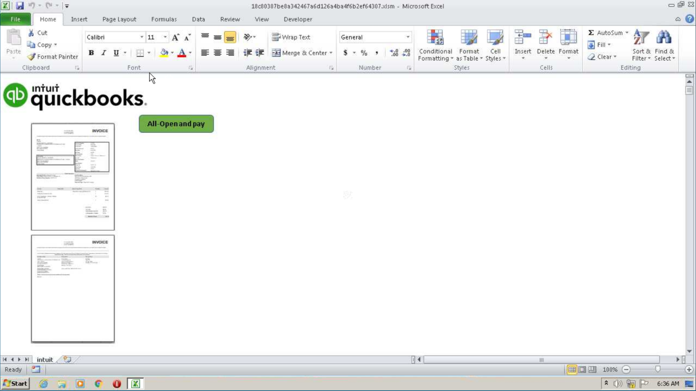

Document Text:
```
All-Open and pay
```

Picture Hashes:
```
MD5 5eb0d853c8f051ae118f4b0a0a8c145d
SHA-1 d797e81f94929963cd12823581188b53aff44494
SHA-256 536936df4750acb8a6e64a304e60ba4c74c0fb8354b01b3d82d3b410eb8226e4 

MD5 fdba5cb8ba272e19f812adbe334e7f37
SHA-1 f4ce0f3a948e5517cc64573c4e660a0534299916
SHA-256 e96c71c6c4f200fb04a46d631edba126eb9ba29e57cf58ca2ff0061d27c169ff 

MD5 38169da54d84f7aba9948109bff21816
SHA-1 8de7541b74190acc436d025b427db2e02c12d938
SHA-256 f99eb4a2792710146fd7f333cbdf595cacf43ddd7e79eab75564c9c9772c93aa 
```

Links:

Malware sample: https://app.any.run/tasks/ab5537b4-8c2b-4779-bd18-a8e4376c8286/

Lure picture VT Link: https://www.virustotal.com/gui/file/536936df4750acb8a6e64a304e60ba4c74c0fb8354b01b3d82d3b410eb8226e4/detection

Lure picture VT Link: https://www.virustotal.com/gui/file/e96c71c6c4f200fb04a46d631edba126eb9ba29e57cf58ca2ff0061d27c169ff/detection

Lure picture VT Link: https://www.virustotal.com/gui/file/f99eb4a2792710146fd7f333cbdf595cacf43ddd7e79eab75564c9c9772c93aa/detection

## Emotet

### "Red Dawn" Template

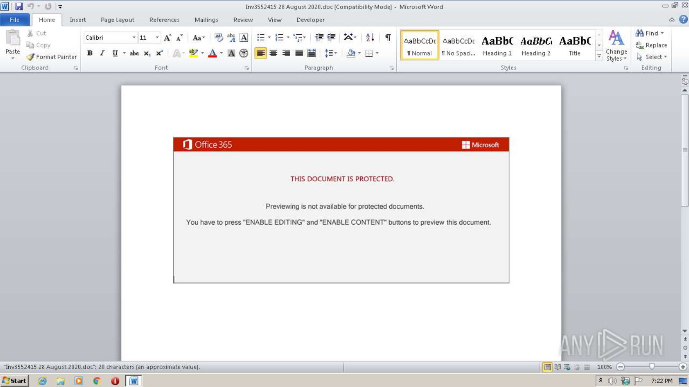

Document Text:

```
THIS DOCUMENT IS PROTECTED.
Previewing is not available for protected documents.
You have to press "ENABLE EDITING" and "ENABLE CONTENT" buttons to preview this document.
```

Picture Hashes:

```
MD5 0B1529E1C2F7579AC605534B123BE006
SHA1 624A9C539555C1569D0DB920B095468DDCEBA18F 
SHA256 9D7A7D55D92B3D1E8CF3DC7CB78034372D9C55789C75D85230C4F12A3FF49109
```

Links:

Malware sample: https://app.any.run/tasks/1bc669d1-d924-452e-b9f6-003e352481c8/

Lure picture VT Link: https://www.virustotal.com/gui/file/9d7a7d55d92b3d1e8cf3dc7cb78034372d9c55789c75d85230c4f12a3ff49109

### "IOS Enable Edition" Template

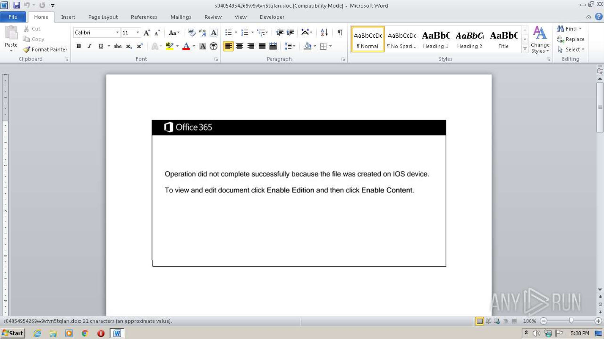

Document Text:

```
Operation did not complete successfully because the file was created on IOS device.
To view and edit document click Enable Editing and then click Enable Content.
```

Picture Hashes:

```
MD5 749B9D18820AD25B4BCFBDC9BCC0F729
SHA-1 FBCA818C86A68F5C7379C711C26E2FD17901B41C
SHA-256 40E748633449A369AC284166C849B9A2A3AD2E7C82FB37EE1D2037B11ED1F060
```

Links:

Malware sample: https://app.any.run/tasks/83e47a5a-506d-4971-9332-acb364ddec1d/

Lure picture VT Link: https://www.virustotal.com/gui/file/40e748633449a369ac284166c849b9a2a3ad2e7c82fb37ee1d2037b11ed1f060

## Hancitor

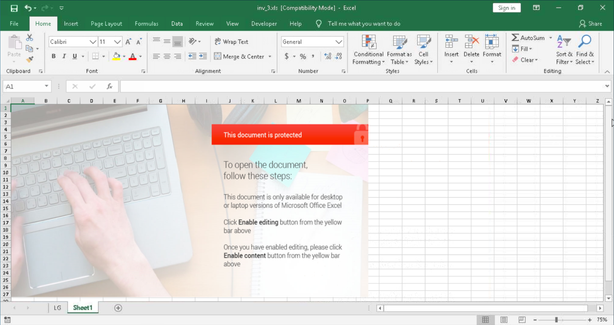

Document Text:

```
This document is protected
To open the document, follow these steps:
This document is only available for desktop or laptop versions of Microsoft Office Excel
Click Enable editing button from the yellow bar above
Once you have enabled editing, please click Enable content button from the yellow bar above
```

Picture Hashes:

```
MD5 fa0bb8740893178f50fe588c699c5229
SHA-1 e7c5f70732cca56bb4d0b79fee7b36f8f560e362
SHA-256 b03f3c35896cd0e36527b485bb846d1058b0015cd423da908cb97f33f5844f13 
```

Links:

Malware sample: https://app.any.run/tasks/ab9808d6-6b19-46bf-b396-7c3cc49340c8/

Lure picture VT Link: https://www.virustotal.com/gui/file/b03f3c35896cd0e36527b485bb846d1058b0015cd423da908cb97f33f5844f13/details

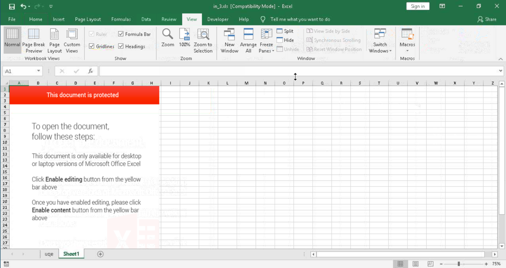

Document Text:

```
This document is protected
To open the document, follow these steps:
This document is only available for desktop or laptop versions of Microsoft Office Excel
Click Enable editing button from the yellow bar above
Once you have enabled editing, please click Enable content button from the yellow bar above
```

Picture Hashes:

```
MD5 6697115f4d556c361be6c25b90e3cd4f
SHA-1 663a80c43e433030af39aa6061bcca50643e3b05
SHA-256 3994ec9595a2f39057dcc20e664110a6f16c7c531542a32bba82c6b77f213991 
```

Links:

Malware sample: https://app.any.run/tasks/f114d2e3-27ff-4e1b-aa77-7d9471a56b42/

Lure picture VT Link: https://www.virustotal.com/gui/file/3994ec9595a2f39057dcc20e664110a6f16c7c531542a32bba82c6b77f213991

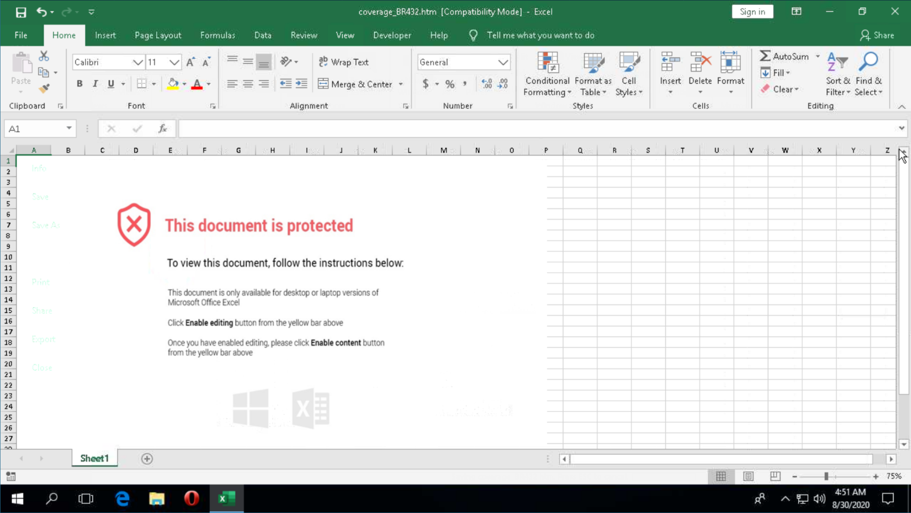

Document Text:

```
This document is protected
To view this document, follow the instructions below:
This document is only available for desktop or laptop versions of Microsoft Office Excel
Click Enable editing button from the yellow bar above
Once you have enabled editing, please click Enable content button from the yellow bar above
```

Picture Hashes:

```
MD5 b62c138f8eaa2cc3109e3fc5379840d4
SHA-1 45adaed167ed9858818310dd72e71429ea42afcc
SHA-256 fd7b9854da7324dcfee74398368f4c86c7d2345e0022c5f1ab7280ee2262796d 
```

Links:

Malware sample: https://app.any.run/tasks/e74a73fa-88c6-4836-9536-82b9b5a07fe6/

Lure picture VT Link: https://www.virustotal.com/gui/file/fd7b9854da7324dcfee74398368f4c86c7d2345e0022c5f1ab7280ee2262796d/details

## Qakbot / Qbot

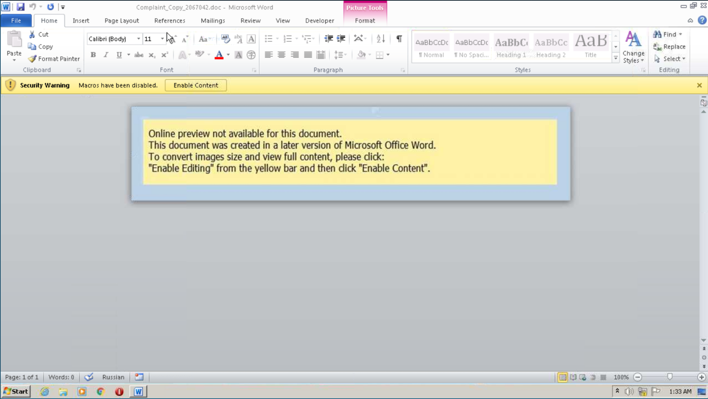

Document Text:

```
Online preview not available for this document.
This document was created in a later version of Microsoft Office Word.
To convert images size and view full content, please click:
"Enable Editing" from the yellow bar and then click "Enable Content".
```

Picture Hashes:

```
MD5 b3b2a528566f121b4cfb6a9d815fb23a 
SHA-1 1bb86e627d62375b8d69d9ab1f9d8a4fff3df2cc 
SHA-256 9860e32498af9619471357247c303018d4e80827aa3f3fc8c24d1168e8b70262
```

Links:

Malware sample: https://app.any.run/tasks/91c822e7-86f4-4854-ab43-202f9a7bec26/

Lure picture VT Link: https://www.virustotal.com/gui/file/9860e32498af9619471357247c303018d4e80827aa3f3fc8c24d1168e8b70262/relations

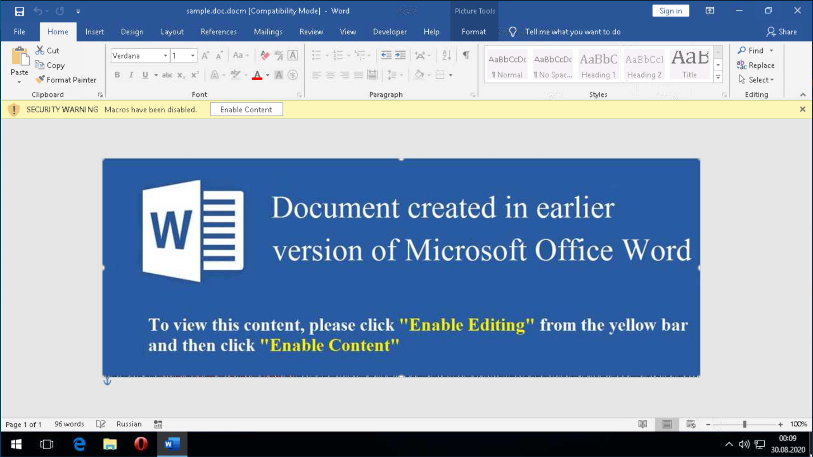

Document Text:

```
Document created in earlier version of Microsoft Office Word
To view this content, please click "Enable Editing" from the yellow bar and then click "Enable Content"
```

Picture Hashes:

```
MD5 64C7FFF6F4720C3F7B9B843331FB31BB 
SHA-1 EF72CEC7B2070524FD0C4B5A4364919FBC1ABEB2
SHA-256 39536CCD3D2BCB0BABCAEEAF9A316359D50F0558C6620B87D3663EE1CC156BB5
```

Links:


Malware sample: https://app.any.run/tasks/cbd7be1c-aa7f-49bc-bb13-836c84f24b06/

Lure picture VT Link: https://www.virustotal.com/gui/file/39536ccd3d2bcb0babcaeeaf9a316359d50f0558c6620b87d3663ee1cc156bb5

## Shathak / TA551

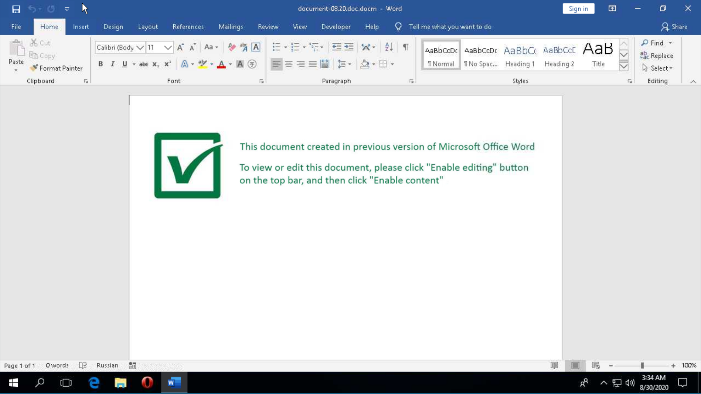

Document Text:

```
This document created in previous version of Microsoft Office Word
To view or edit this document, please click "Enable editing" button on the top bar, and then click "Enable content"
```

Picture Hashes:

```
MD5 6ad5aebd172b06d81f596627c19c3551
SHA-1 1a1b038cbfd645d122bd20252b2c105af715d4da
SHA-256 66ac2ff2a0c49f78f5c3823681ecef6c60da5eca1bdf003cc1536c4ba4f209ff 
```

Links:

Malware sample: https://app.any.run/tasks/c33bd52b-f56e-486f-9b7f-55ac112e8554/

Lure picture VT Link: https://www.virustotal.com/gui/file/66ac2ff2a0c49f78f5c3823681ecef6c60da5eca1bdf003cc1536c4ba4f209ff/relations

## Trickbot

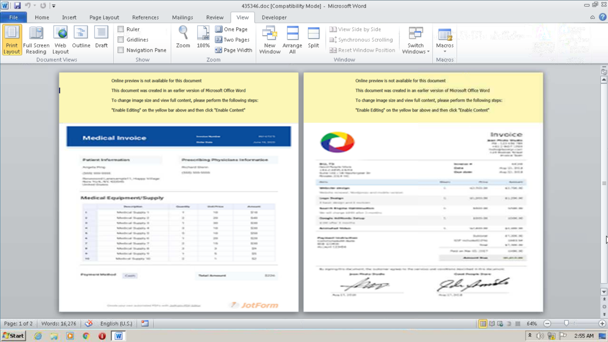

Document Text:

```
Online preview is not available for this document
This document was created in an earlier version of Microsoft Office Word
To change image size and view full content, please perform the following steps:
"Enable Editing" on the yellow bar above and then click "Enable Content"
```

Picture Hashes:

```
MD5 ca45cfaa099375ccffb9118631cc7b43
SHA-1 3132f974ec701d60b1c76a1aff694cc14739aff6
SHA-256 37cc23aa1c56d5e97d53d3852958bae51b3db746da659d0558cc23051f2f9865 

MD5 c5aede0b4df2cbbbe78ad02ee84b10dd
SHA-1 6ed5cbc070df409f820e978ed95bc4d4c1449692
SHA-256 398dbeda4d9040b2406acd4be0f0f218e63addaea9bf93aa8d1e090921ea1923

MD5 cb5229a164f1d2b3a2471e30b96d4ae5
SHA-1 3a68ac601db3c99baaa0a24baf9df9ea66b55357
SHA-256 a2d37efa03e50c1fcb70cdb334a3cddea904ee7293ed5011b2c6a4f7b982a0ca

MD5 ac8c3f36d61e18c977103c168c9ebe28
SHA-1 60112b4d0bf757501319085795015c3091521df8
SHA-256 a0bffccbf5251af61e1991e00df894b416ab25ed28e28bd37c9c99760fb05f05
```

Links:

Malware sample: https://app.any.run/tasks/838ef026-b5bf-410d-b308-98341a533ab9/

Lure picture VT Link: https://www.virustotal.com/gui/file/37cc23aa1c56d5e97d53d3852958bae51b3db746da659d0558cc23051f2f9865/detection

Lure picture VT Link: https://www.virustotal.com/gui/file/a2d37efa03e50c1fcb70cdb334a3cddea904ee7293ed5011b2c6a4f7b982a0ca/detection

Lure picture VT Link: https://www.virustotal.com/gui/file/398dbeda4d9040b2406acd4be0f0f218e63addaea9bf93aa8d1e090921ea1923/detection

Lure picture VT Link: https://www.virustotal.com/gui/file/a0bffccbf5251af61e1991e00df894b416ab25ed28e28bd37c9c99760fb05f05/detection

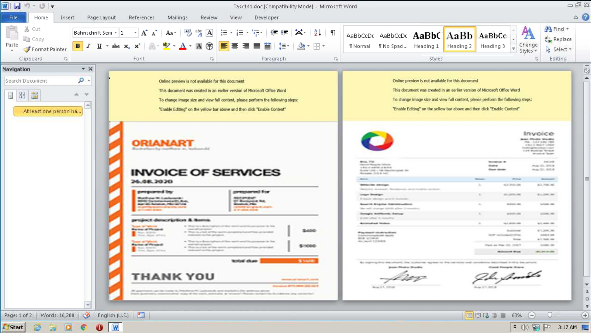

Document Text:

```
Online preview is not available for this document
This document was created in an earlier version of Microsoft Office Word
To change image size and view full content, please perform the following steps:
"Enable Editing" on the yellow bar above and then click "Enable Content"
```

Picture Hashes:

```
MD5 ca45cfaa099375ccffb9118631cc7b43
SHA-1 3132f974ec701d60b1c76a1aff694cc14739aff6
SHA-256 37cc23aa1c56d5e97d53d3852958bae51b3db746da659d0558cc23051f2f9865 

MD5 9865c264c66535d3b55981954e855e95
SHA-1 c1a2979be0c232f5f636f32a9cfae2d879de3917
SHA-256 6019abbfabd990b7c155078b908795be6a8bd0c40ec0eb218ab67cf0e185df55 

MD5 ac8c3f36d61e18c977103c168c9ebe28
SHA-1 60112b4d0bf757501319085795015c3091521df8
SHA-256 a0bffccbf5251af61e1991e00df894b416ab25ed28e28bd37c9c99760fb05f05 
```

Links:

Malware sample: https://app.any.run/tasks/6729bd11-6a89-4052-9445-4a0233313f8a/

Lure picture VT Link: https://www.virustotal.com/gui/file/37cc23aa1c56d5e97d53d3852958bae51b3db746da659d0558cc23051f2f9865/detection

Lure picture VT Link: https://www.virustotal.com/gui/file/6019abbfabd990b7c155078b908795be6a8bd0c40ec0eb218ab67cf0e185df55/detection

Lure picture VT Link: https://www.virustotal.com/gui/file/a0bffccbf5251af61e1991e00df894b416ab25ed28e28bd37c9c99760fb05f05/detection

## ZLoader

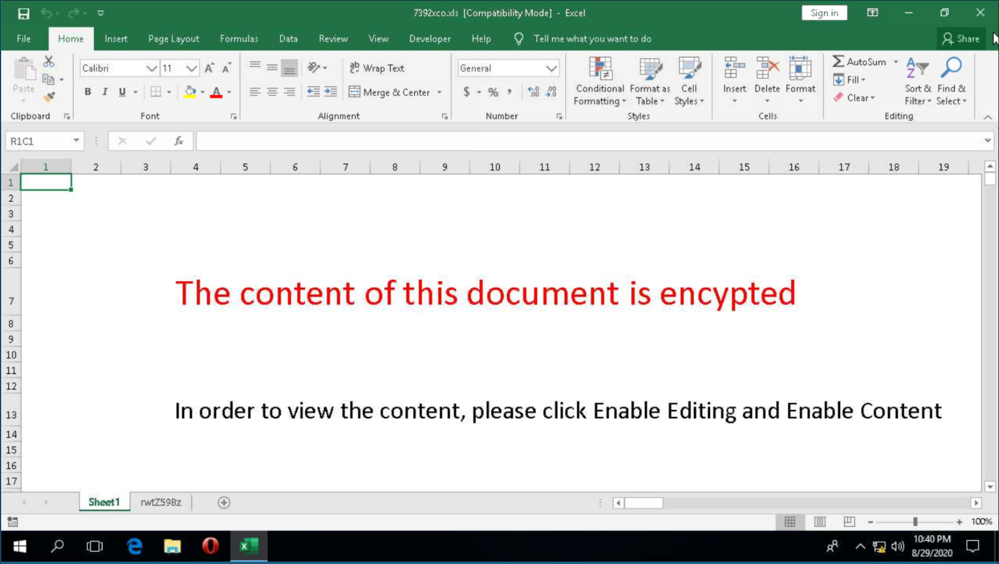

Document Text:

```
The content of this document is encrypted
In order to view the content, please click Enable Editing and Enable Content
```

Picture Hashes:

```
n/a
```

Links

Malware sample: https://app.any.run/tasks/e9456ae8-beab-437a-a475-c199133ad2d8/

Lure picture VT Link: n/a